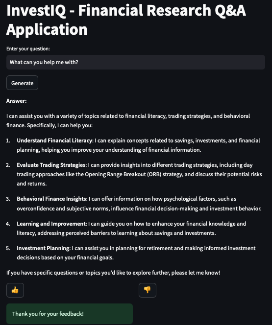
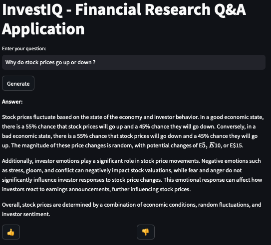
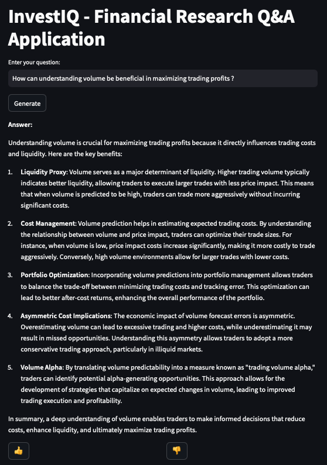
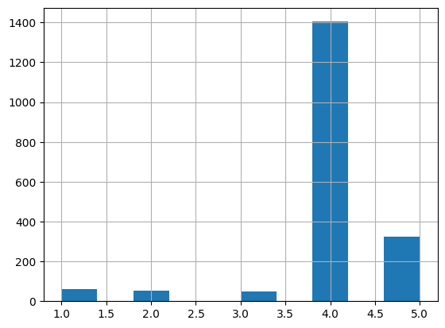

# Financial Research Q&A Application
A comprehensive Question and Answer application powered by Retrieval-Augmented Generation (RAG), leveraging a knowledge base of financial research papers. This project allows users to ask questions related to trading strategies and behavioral finance and receive accurate, context-aware answers.

In the rapidly evolving field of finance, staying updated with the latest research is crucial. This application bridges the gap by providing a user-friendly interface to query a curated knowledge base of financial research papers. Utilizing NLP techniques and large language models (LLMs), the app delivers precise answers to user questions, enhancing accessibility to complex financial insights.

### Snapshots from the app.
  

## Architecture Overview
 - Data Ingestion: Research papers are preprocessed, chunked, and embedded using domain-specific embedding models.
 - Indexing: Processed data is indexed in Elasticsearch for efficient retrieval.
 - User Interface: A Streamlit app provides an interactive front-end for users to submit questions.
 - RAG Pipeline:
  - Query Processing: User questions are embedded and used to retrieve relevant documents using hybrid search with re-ranking.
  - Prompt Construction: Retrieved documents are combined with the question to form a prompt.
  - Answer Generation: An LLM generates the answer based on the prompt.
  - Feedback Loop: User feedback is collected and stored for future improvements.

## Technology Stack
 - Programming Language: Python 3.10
 - Front-end: Streamlit
 - Back-end:
    - Language Models: OpenAI GPT-4o-mini (also tested GPT-4o and GPT-3.5 Turbo)
    - Embedding Models: Sentence Transformers (all-MiniLM-L6-v2, FinLang/finance-embeddings-investopedia, philschmid/bge-base-financial-matryoshka)
 - Databases:
    - Elasticsearch: For text search and retrieval
    - PostgreSQL: For storing conversations and feedback
 - Containerization: Docker & Docker Compose
 - Others:
    - Psycopg2: PostgreSQL adapter for Python
    - Elasticsearch Python Client
    - OpenAI Python SDK

## Evaluation and Performance
### Retrieval Evaluation
We conducted extensive testing of the retrieval component to ensure the most relevant documents are fetched for answer generation.
### Retrieval Methods Tested
 - Simple Keyword Search: Utilizes basic keyword matching to retrieve documents.
 - Hybrid Search: Combines keyword search with vector similarity using embeddings.
 - Re-ranking with Parameter Tuning: Applies re-ranking algorithms to improve the ordering of retrieved documents, adjusting parameters to optimize performance.
### Ground Truth Dataset Creation
 - LLM-Assisted Question Generation: For each chunk of the research papers, we used an LLM to generate 5 questions that the chunk could answer. (check exploratory  here)
### Answer Generation Evaluation
 - We assessed the quality of the answers produced by the RAG pipeline using the retrieved documents.

### Evaluation Metrics Used
 - Hit Rate: Measures the proportion of times the relevant document appeared in the top N retrieved documents.
 - Mean Reciprocal Rank (MRR): Evaluates how high the first relevant document ranks in the list of retrieved documents.
 - Relevancy Calculation Using Similarity Scores: Computes the cosine similarity between the embeddings of the retrieved documents and the query.
 - Relevancy Calculation Using LLM as a Judge:
  - Method: The LLM compares the generated answer with the reference answer (from the ground truth dataset) and provides a relevancy score.
### Results and Findings
 - Hit rate : 0.79
 - MRR : 0.49
 Several iterations were tried to improve the metrics either by tweaking the re-ranking parameters, or parameters of keyword search and semantic search, also trying different sentence transformers (Check  here.).
 - Relevancy scores distribution after using LLM as a judge:
  - Scoring  Guidelines for LLM as a judge:
    - 5: The RAG-generated answer is completely correct, fully addresses the question, and is as comprehensive as the reference answer.
    - 4: The answer is correct but may lack minor details compared to the reference.
    - 3: The answer is partially correct but misses significant details.
    - 2: The answer has some correct elements but contains notable inaccuracies.
    - 1: The answer is incorrect or irrelevant to the question.
  


## Setup Instructions
### Prerequisites
Docker and Docker Compose installed on your machine.
An OpenAI API Key. Sign up at OpenAI to obtain one.
 - Clone the Repository : 
```bash
git clone https://github.com/yourusername/investiq-qna-rag.git
cd investiq-qna-rag
```
 - Set Up Environment Variables : Create a .env file in the root directory with the following content:
```env
# PostgreSQL Configuration
DB_HOST=db
DB_PORT=5432
DB_NAME=your_database_name
DB_USER=your_username
DB_PASSWORD=your_password

# Elasticsearch Configuration
ELASTICSEARCH_HOST=elasticsearch
ELASTICSEARCH_PORT=9200

# OpenAI API Key
OPENAI_API_KEY=your_openai_api_key
```
Note: Replace the placeholders with your actual credentials.
 - Prepare Data : Place your financial research papers (PDF format) in the data/ directory.

 - Build and Run the Application : Use Docker Compose to build and start all services:
```bash
docker-compose up --build
```
 - Access the Application : Open your web browser and navigate to:
```
http://localhost:8501
```

## Usage
### Asking Questions
 - Enter your question in the input box provided.
 - Click the "Generate" button to receive an answer.
### Providing Feedback
 - After receiving an answer, use the 👍 or 👎 buttons to provide feedback.
 - Your feedback helps improve the accuracy and relevance of future answers.

## Going forward
 - Implement Grafana dashboard, metrics are already being captured in the tables.
 - Expand Knowledge Base: Incorporate more research papers and update regularly to include the latest studies.
 - Fine-Tune Models: Train domain-specific language models to improve accuracy and reduce dependency on external APIs.
 - Optimize Retrieval: Explore advanced retrieval techniques, such as neural search and contextual embeddings.
 - Integrate company reports, Warren Buffett letters and other literature of the same kind; and eventually generating a dashboard which picks up a stock fundamentals and scores wether to Buy/Sell/Hold.
 - Full-Stack Development: Integrating front-end and back-end components with containerization.


## Contributing
We welcome contributions from the community!
Fork the Repository, Clone Your Fork, Create a New Branch, Implement your feature or fix, Commit, Push and finally create a Pull Request


Thank you for checking out this project!


<!-- 

brew services start postgresql

docker run -it \
    --rm \
    --name elasticsearch \
    -p 9200:9200 \
    -p 9300:9300 \
    -e "discovery.type=single-node" \
    -e "xpack.security.enabled=false" \
    elasticsearch:8.4.3


version: '3.8'

services:
  app:
    build: 
      dockerfile: Dockerfile
    container_name: app
    depends_on:
      - localhost
      - elasticsearch
    ports:
      - "8501:8501"
    environment:
      - DB_HOST=${DB_HOST}
      - DB_PORT=${DB_PORT}
      - DB_NAME=${DB_NAME}
      - DB_USER=${DB_USER}
      - DB_PASSWORD=${DB_PASSWORD}
      - ELASTICSEARCH_HOST='elasticsearch'
      - ELASTICSEARCH_PORT=9200
      - OPENAI_API_KEY=${OPENAI_API_KEY}
    volumes:
      - .:/app

  localhost:
    image: postgres:16
    container_name: postgres_db
    environment:
      - POSTGRES_USER=${DB_USER}
      - POSTGRES_PASSWORD=${DB_PASSWORD}
      - POSTGRES_DB=${DB_NAME}
    ports:
      - "5432:5432"
    volumes:
      - pgdata:/var/lib/postgresql/data

  elasticsearch:
    image: elasticsearch:8.4.3
    container_name: elasticsearch
    environment:
      - "discovery.type=single-node"
      - "xpack.security.enabled=false"
      - "ES_JAVA_OPTS=-Xms512m -Xmx512m"
    ports:
      - "9200:9200"
      - "9300:9300"
    ulimits:
      memlock:
        soft: -1
        hard: -1
    mem_limit: 1g
    volumes:
      - esdata:/usr/share/elasticsearch/data

volumes:
  pgdata:
  esdata: -->
